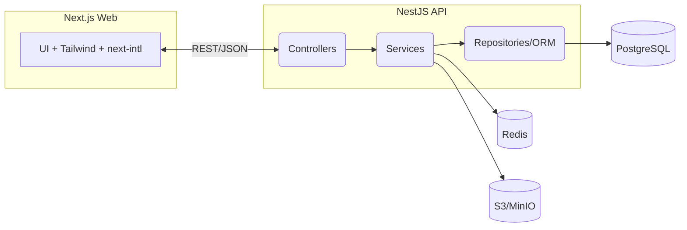

# Architecture

- **Internationalization:** ICU JSON per locale; `/[locale]/...` routing
- **Security:** RBAC, audit logs (planned), HTTPS, JWT/session (TBD)
- **Scalability:** API stateless, queue for jobs (BullMQ planned), CDN for static
