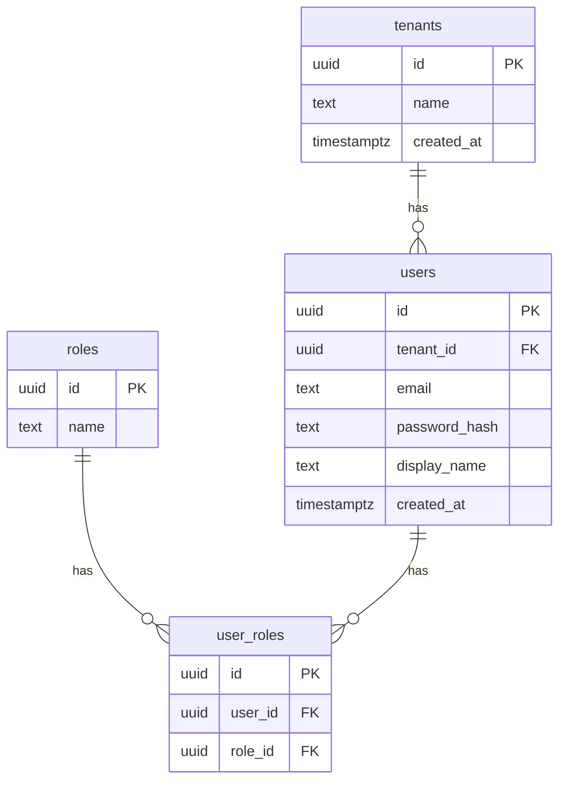

# Database Schema (Initial)

```mermaid
erDiagram
  tenants ||--o{ users : has
  roles ||--o{ user_roles : has
  users ||--o{ user_roles : has

  tenants {
    uuid id PK
    text name
    timestamptz created_at
  }
  users {
    uuid id PK
    uuid tenant_id FK
    text email
    text password_hash
    text display_name
    timestamptz created_at
  }
  roles {
    uuid id PK
    text name
  }
  user_roles {
    uuid id PK
    uuid user_id FK
    uuid role_id FK
  }
```
Further tables: clients, cases, courts, sessions, documents, invoices, etc.
RLS will restrict rows by `tenant_id` (to be added in migrations).
